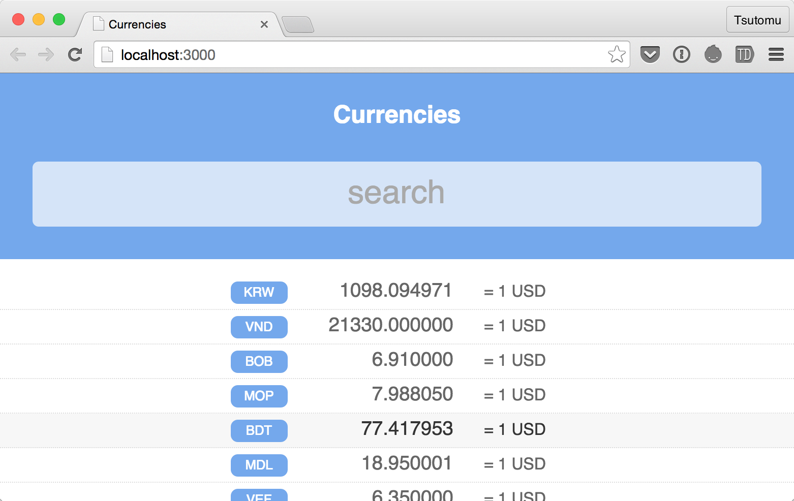

# Riot.js Currency Calculator

This is a simple example with [Riot.js](https://muut.com/riotjs/) and [Browserify](http://browserify.org/).



## Try

Access [Riot.js Currency Calculator](http://cognitom.github.io/riotjs-currency-calculator/).

## Clone and build

0. Clone this repo.
0. `$ npm install`
0. `$ npm start`

## Gulp and Browserify

In this example, some `gulp` tasks are defined.

- `clean`: clean up generated files
- `browserify`: compile .js and .tag files
- `css`: autoprefix and minify
- `others`: move other files - index.html ...etc

### Browserify basic

```coffeescript
gulp.task 'browserify', ->
  browserify
    entries: [$.app]
    debug: true
  .transform riotify
  .bundle()
  .pipe source path.basename $.app
  .pipe buffer()
  .pipe gulp.dest $.dist
```

## CSS *-processors

Riot.js doesn't support these natively.

- CSS pre-processors like LESS or Sass
- CSS post-processors like autoprefixer
- CSS import, compression, lint, ...etc

But we can use these CSS processors in this way. 

- Ignore `<style>...</style>` in `browserify` task
- Extract `<style>...</style>` in `css` task

There're some good helper for this purpose.

### transformify

Remove `<style>...</style>` before `riotify`

```coffeescript
transformify (tag) ->
  tag.replace /<style>[\s\S]*<\/style>/gm, ''`
```

### gulp-replace

Extract `<style>...</style>` from `.tag` files.

```coffeescript
replace /(^[\s\S]*<style>|<\/style>[\s\S]*$)/gm, ''`
```
